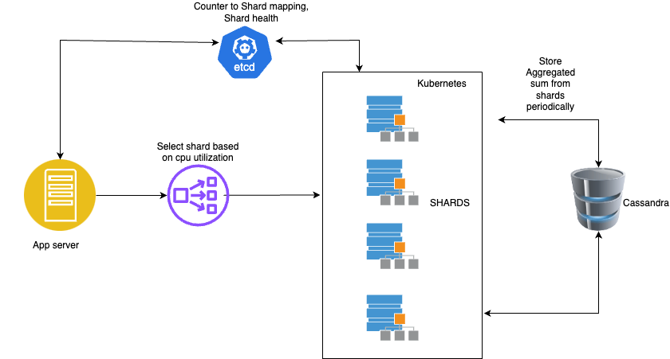

# Sharded Counters



## Overview

In distributed systems, maintaining accurate counters under high concurrency can be challenging due to bottlenecks and contention. Sharded counters address this by distributing the counter's value across multiple shards, allowing for scalable and efficient counting mechanisms.

## Features

- **High Throughput:** Distributes load across multiple shards to handle a large number of operations concurrently.
- **Fault Tolerance:** Ensures system reliability by mitigating single points of failure.
- **Scalability:** Dynamically adjusts the number of shards based on workload demands.

## Architecture

The system comprises the following components:

1. **App Server:** Processes API requests for counter operations.
2. **Service Registry (e.g., Etcd):** Maintains metadata about active shards and their mappings.
3. **Shard Cluster:** Managed by Kubernetes, each pod handles a portion of the counter's data.
4. **Persistent Storage (e.g., Cassandra):** Stores counter data for durability and recovery.

## Workflow

1. **Counter Creation:** A new counter is initialized and distributed across a predefined number of shards.
2. **Increment/Decrement Operations:** Incoming requests are routed to specific shards based on a metrics (cpu utilization) based selection statedy.
3. **Read Operations:** To retrieve the total count, values from all shards are aggregated.

## Getting Started

### Prerequisites

- [Go](https://golang.org/doc/install) (version 1.16 or higher)
- [Docker](https://docs.docker.com/get-docker/)
- [Kubernetes](https://kubernetes.io/docs/setup/) cluster
- [Etcd](https://etcd.io/docs/v3.4.0/getting-started/) service
- [Cassandra](https://cassandra.apache.org/_/quickstart.html) database

### Installation

1. **Clone the Repository:**

   ```bash
   git clone https://github.com/sagarsuperuser/sharded-counters.git
   cd sharded-counters
   ```

2. **Run the Application:**

   ```bash
   go run ./cmd/sharded-counters 
   ```

3. **Build Application using Docker:**
   ```bash
   docker build --no-cache -t <username>/sharded-counter:latest . && docker push <username>/sharded-counter:latest
   ```

4. **Deploy to Kubernetes:**

   - Ensure your Kubernetes context is set correctly.
   - Apply the Kubernetes manifests:

     ```bash
       kubectl apply -f kubernetes/deployment_shard.yaml && kubectl apply -f kubernetes/deployment_app.yaml
     ```

## Usage

- **Increment a Counter:**

  ```bash
  curl -X PUT http://<app-server-ip>/counter/increment -d '{"counter_id": "example-counter"}'
  ```

- **Decrement a Counter:**

  ```bash
  curl -X PUT http://<app-server-ip>/counter/decrement -d '{"counter_id": "example-counter"}'
  ```

- **Get Counter Value:**

  ```bash
  curl http://<app-server-ip>/counter/value?counter_id=example-counter
  ```

## Contributing

Contributions are welcome! Please fork the repository and submit a pull request.

## License

This project is licensed under the MIT License. See the [LICENSE](LICENSE) file for details.

## Future Enhancements
1. **gRPC-based Communication:** Replace traditional HTTP-based communication between the app and shards with gRPC for enhanced performance, lower latency, and efficient serialization.
2. **Enhanced Fault Tolerance with Replication:** Integrate robust replication mechanisms for each shard to ensure high availability and seamless recovery from failures.
3. **Leader-Follower Architecture for Shards:** Adopt a leader-follower model primarily for fault tolerance, where the leader manages write operations, and followers act as hot standbys, ready to take over in case of leader failure.
4. **Scheduled Data Synchronization Across Shards:** Implement periodic data replication schedules to maintain consistent data integrity and availability across shards.
5. **Advanced Request Logging for Recovery:** Maintain detailed logs of all operations on the leader, enabling the replay of operations in case a follower needs to be promoted to a leader.
6. **Efficient Aggregated Count Storage:** Regularly compute and persist aggregated counts across all shards in a scalable storage solution, like Cassandra, to optimize on get counter value queries.
